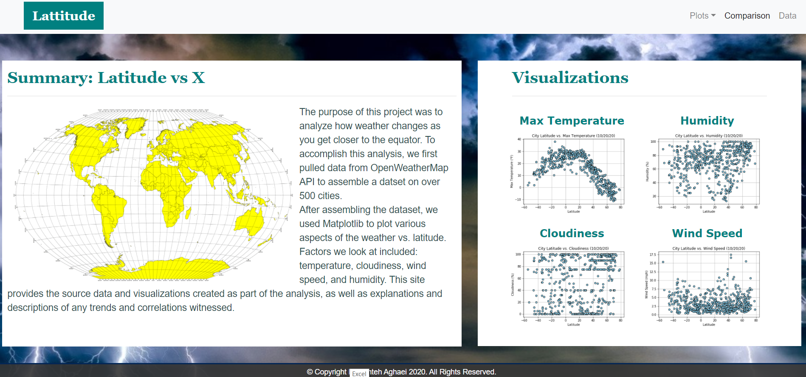
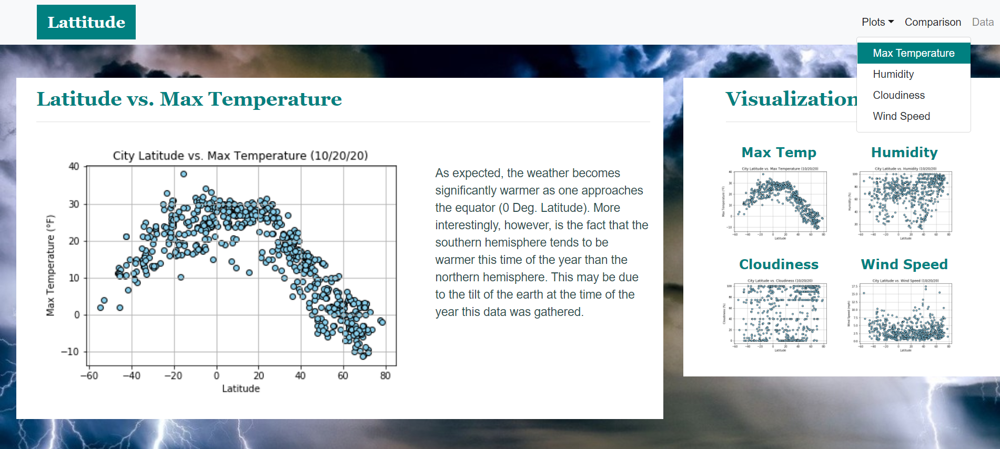
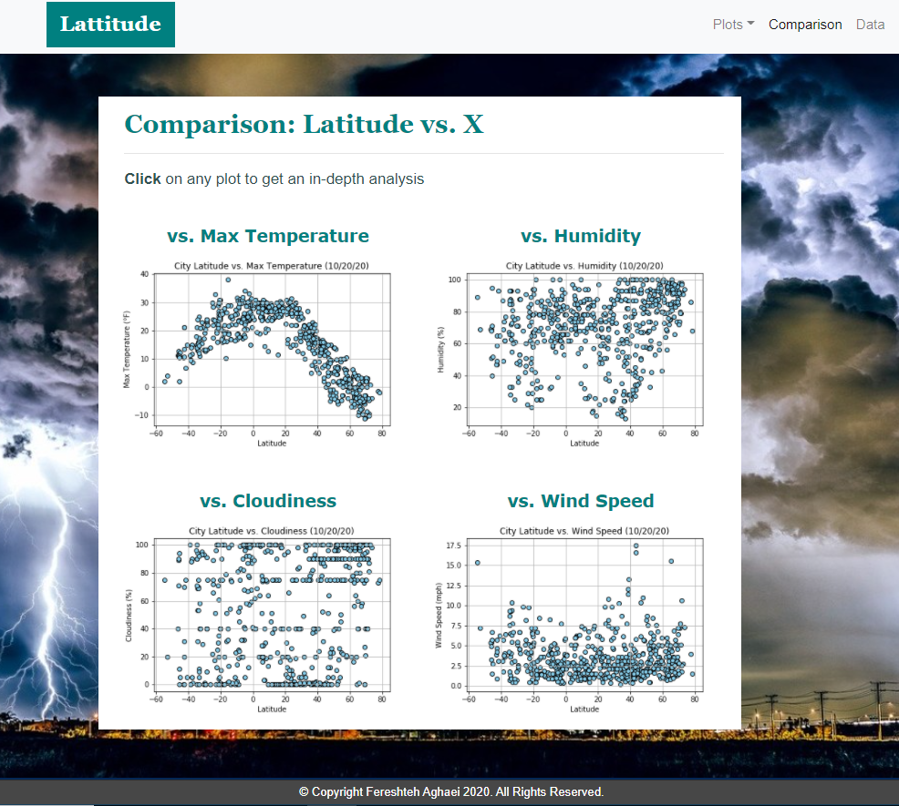
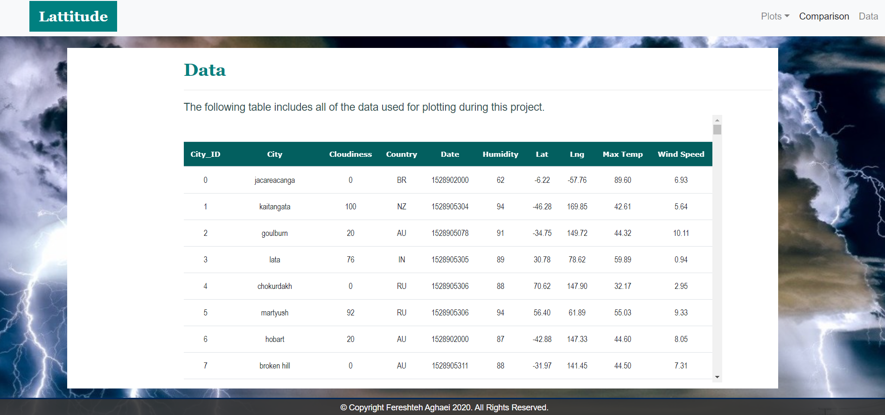
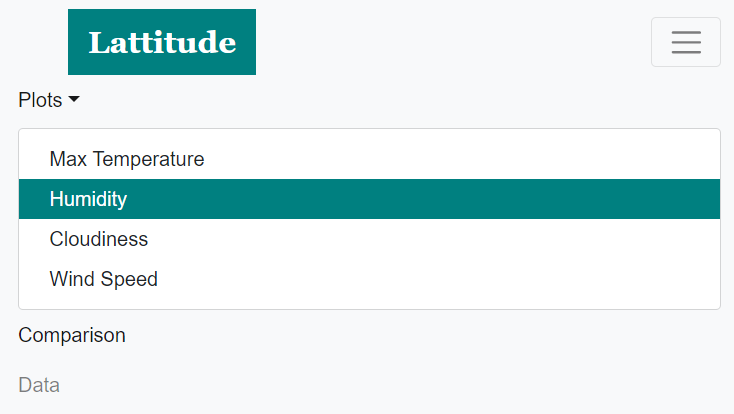

# Web Visualization Dashboard (Latitude)

https://fereshtehaghaei.github.io/WebDesignChallenge/index.html

## Background

We'll be creating a visualization dashboard website using visualizations we've created in a past assignment. Specifically, we'll be plotting [weather data](https://github.com/fereshtehaghaei/Web-Design-Challenge/blob/master/Resources/cities.csv). In building this dashboard, we'll create individual pages for each plot and a means by which we can navigate between them.

### Before You Begin

## Background

Created a Visualization Dashboard Website of Weather in 500+ World Cities Relative to the Equator at Different Latitudes Using HTML5, CSS3 and Bootstrap 4, plotted [weather data](https://github.com/fereshtehaghaei/Web-Design-Challenge/blob/master/Resources/cities.csv)

## Objectives

In building this dashboard, created individual pages for each plot and a means by which we can navigate between them. These pages will contain the visualizations and their corresponding explanations. We'll also have a landing page, a page where we can see a comparison of all of the plots, and another page where we can view the data used to build them.

### Website Requirements:

The website must consist of 7 pages total, including:

- A Landing Page containing:
  - An explanation of the project
  - Links to each visualizations page

Four `Visualization Pages`, each with:

- A descriptive title and heading tag
- The plot/visualization itself for the selected comparison
- A paragraph describing the plot and its significance

A `Comparisons" Page` that:

- Contains all of the visualizations on the same page so that it can be easily visually compared

- Uses a Bootstrap grid for the visualizations

  - The grid must be two visualizations across on screens medium and larger, and 1 across on extra-small and small screens

    

A `Data Page` that:

- Displays a responsive table containing the data used in the visualizations
  - The table must be a Bootstrap table component
  - The data must come from exporting the `.csv` file as HTML, or converting it to HTML

The website must, at the top of every page, have a navigation menu that:

- Has the name of the site on the left of the nav which allows users to return to the landing page from any page
- Contains a dropdown on the right of the navbar named `Plots` which provides links to each individual visualization page

- - -

### Copyright

Fereshteh Aghaei © 2021. All Rights Reserved.